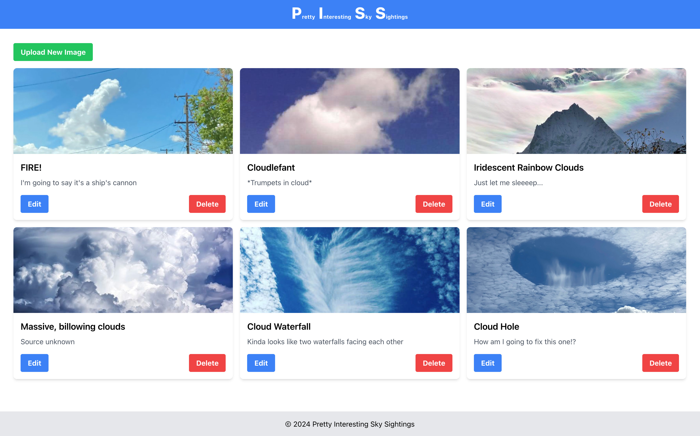

# PISS Project



This repository is the main repository for the Pretty Interesting Sky Sightings project, a generic CRUD enabled photo album style app.

This repository includes both backend and frontend components as submodules.

## Project Structure in Brief
```plaintext
.
├── backend/               # Python backend using FastAPI
│ ├── app/
│ │ ├── main.py            # FastAPI application entry point
│ │ ├── routes/            # API route definitions
│ │ ├── models/            # Database models
│ │ └── init_db.py         # Database initialization script
│ ├── static/
│ │ └── images/            # Image files
│ ├── README.md            # Backend-specific documentation
│ ├── .gitignore           # Git ignore file for backend
│ └── pyproject.toml       # Python project dependencies and configuration
│
├── frontend/              # React frontend
│ ├── src/
│ │ ├── Components/        # All the interesting stuff in here
| │ │ ├── ImageGallery.js  # Image gallery component
| │ │ └── ...
│ │ ├── App.js             # Main React component
│ │ └── config.js          # Configuration file
│ ├── public/              # Public assets directory
│ ├── README.md            # Frontend-specific documentation
│ └── package.json         # Node.js dependencies and scripts
│
├── docker-compose.yml     # Docker Compose configuration
├── Dockerfile             # Docker configuration for building the application
├── nginx.conf             # Nginx configuration file
├── README.md              # Main project documentation
└── .gitmodules            # Git submodules configuration
```

## Getting Started

### Prerequisites

- Docker
- Docker Compose

#### Installing Docker

Follow the instructions on the [official Docker website](https://docs.docker.com/get-docker/) to install Docker on your system.

#### Installing Docker Compose

Follow the instructions on the [official Docker Compose website](https://docs.docker.com/compose/install/) to install Docker Compose on your system.

### Cloning the Repository

First, clone the main repository and initialize the submodules:

```sh
git clone https://github.com/jkarenko/piss-site
cd piss-site
git submodule update --init --recursive
```

### Running the Project

To build and run the project using Docker Compose, execute:

```sh
docker-compose up --build
```

### Backend

The backend is a Python project managed with Poetry. Refer to the [backend README.md](backend/README.md) for detailed instructions.

### Frontend

The frontend is a Node.js project. Refer to the frontend [frontend README.md](frontend/README.md) for detailed instructions.
